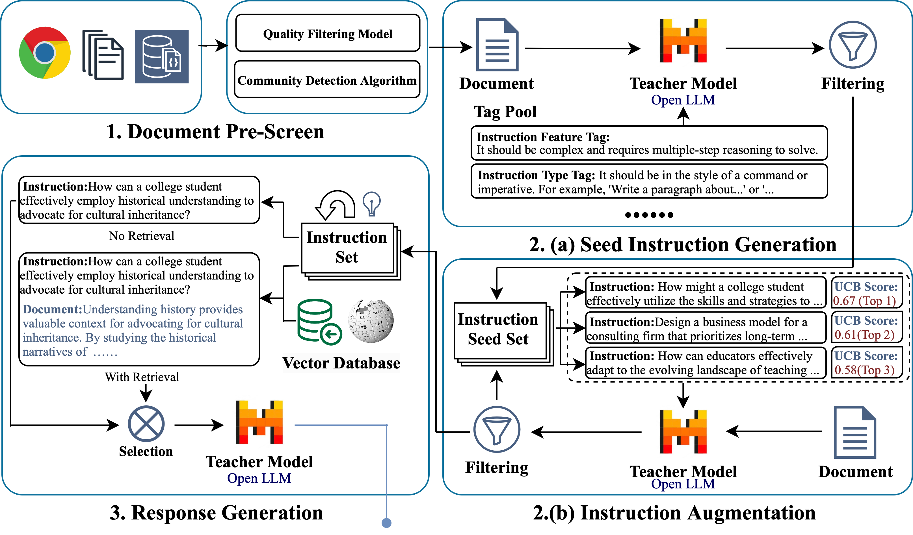
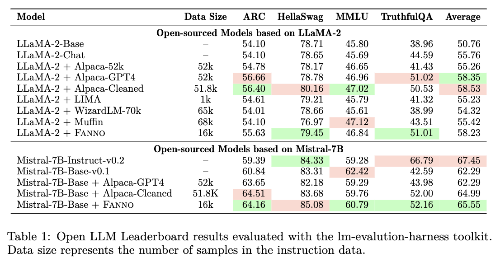
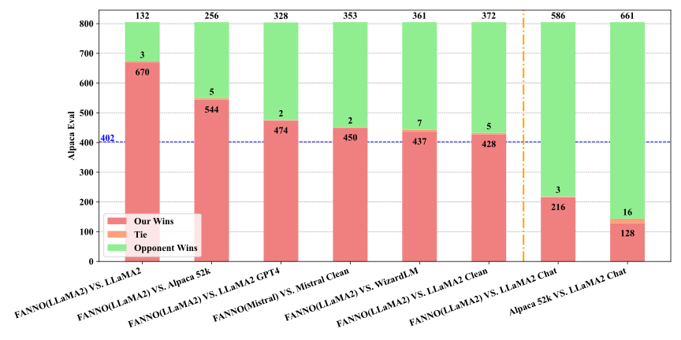
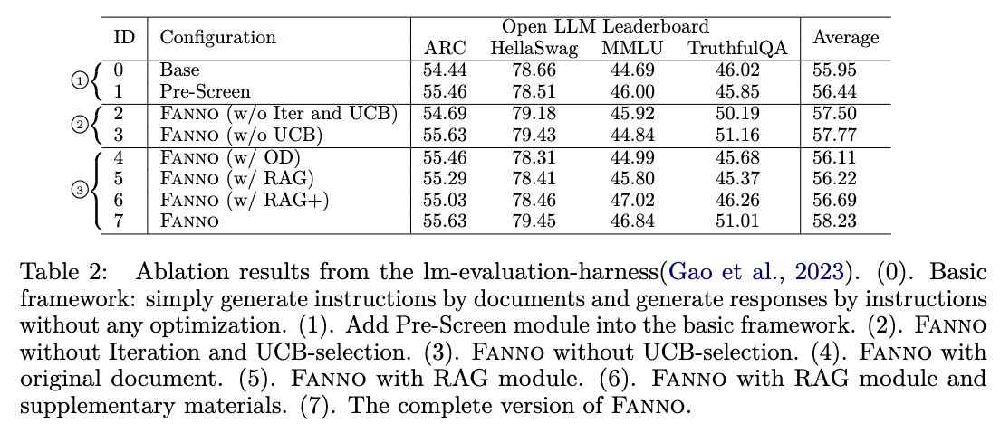

# FANNO: Augmenting High-Quality Instruction Data with Open-Sourced LLMs Only

## Description

FANNO is a fully autonomous, open-sourced framework that revolutionizes the annotation process without the need for pre-existing annotated data. Utilizing a Mistral-7b-instruct model, FANNO efficiently produces diverse and high-quality datasets through a structured process involving document pre-screening, instruction generation, and response generation. Experiments on Open LLM Leaderboard and AlpacaEval benchmark show that FANNO can generate high-quality data with diversity and complexity for free, comparable to human-annotated or cleaned datasets like Alpaca-GPT4-Cleaned.

## Authors

He Zhu†♣, Junyou Su†, Tianle Lun†, Yichen Tao†*, Wenjia Zhang♣, Zipei Fan†, Guanhua Chen†

†Southern University of Science and Technology, ♣Peking University  
<small>*Indicates Equal Contribution</small>

## Links

- [Paper](https://arxiv.org/pdf/ARXIV_PAPER_ID.pdf)
- [Supplementary](static/pdfs/supplementary_material.pdf)
- [Code](https://github.com/zhuchichi56/FANNO)
- [arXiv](https://arxiv.org/abs/ARXIV_PAPER_ID)

## Abstract

Instruction fine-tuning stands as a crucial advancement in leveraging large language models (LLMs) for enhanced task performance. However, the annotation of instruction datasets has traditionally been an expensive and laborious process, often reliant on manual annotations or costly API calls of proprietary LLMs. To address these challenges, we introduce FANNO, a fully autonomous, open-sourced framework that revolutionizes the annotation process without the need for pre-existing annotated data. Utilizing a Mistral-7b-instruct model, FANNO efficiently produces diverse and high-quality datasets through a structured process involving document pre-screening, instruction generation, response generation. Experiments on Open LLM Leaderboard and AlpacaEval benchmark show that the FANNO can generate high-quality data with diversity and complexity for free, comparable to human-annotated or cleaned datasets like Alpaca-GPT4-Cleaned.

## FANNO Framework

Overview of FANNO framework. **(1) Document Pre-Screen**: We process the unlabeled text data with filters and community detection algorithm. **(2a) Seed Instruction Generation**: FANNO generates seed instructions from pre-screened documents with diverse task types and difficulty levels through a tag pool. **(2b) Instruction Augmentation**: New instructions are augmented conditioned on the documents and few-shot examples selected from the seed instructions with UCB algorithm. **(3) Response Generation**: The responses to instructions are generated directly by the teacher LLM, or based on the concatenation of the corresponding document and retrieved document.

## Experiment Result

The comparative experiments of FANNO with other models demonstrate the superiority of our work.

1. For diverse base models like LLaMA and Mistral, our framework consistently achieves top rankings in the LLM-open-leaderboard, even rivaling the models fine-tuned with Alpaca-GPT4-Cleaned, which underwent augmentation with proprietary models and manual selection.
2. Compared to other similar automatic instruction annotation frameworks like Humpback, Muffin, WizardLM, we adhered to the principle of fairness as much as possible by fully utilizing the officially published datasets, and experiments proved that FANNO achieved excellent results with a smaller dataset.

### AlpacaEval

As shown in this Figure, our model marginally outperforms the Alpaca-GPT4-Cleaned’s fine-tuned variant on the AlpacaEval benchmark, attesting to the superiority of our Fanno framework.

### Ablation Experiments

## BibTeX

BibTex Code Here

